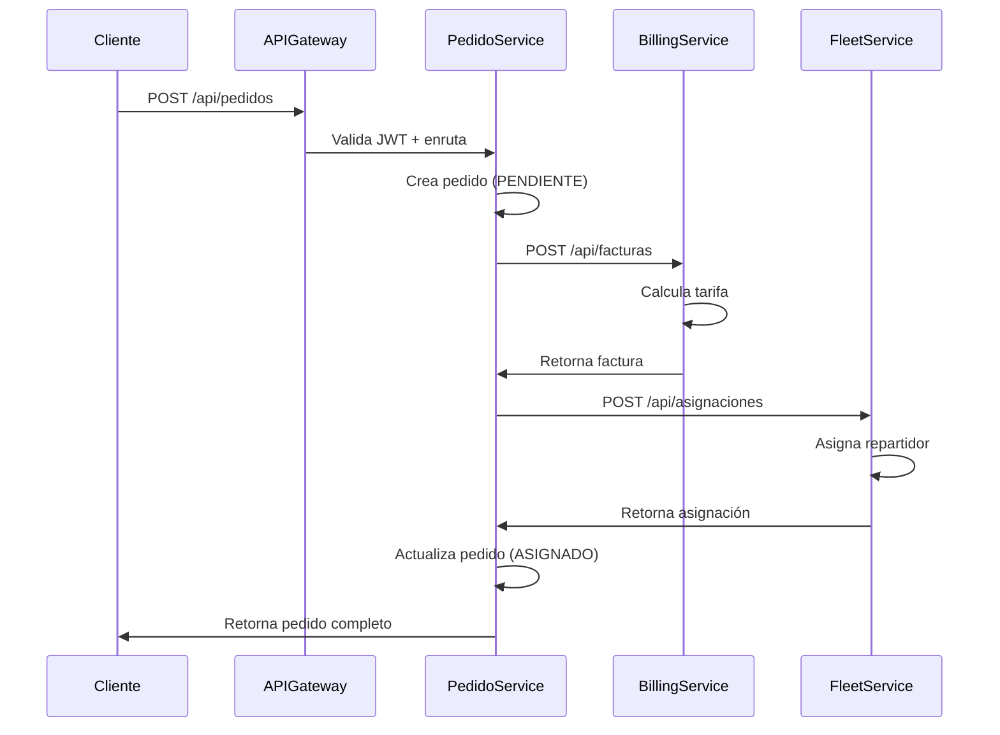

# 🚚 EntregaExpress_P2

**Sistema de Gestión Logística Distribuido**

Plataforma empresarial de gestión logística basada en **microservicios con Spring Boot** para la administración eficiente de órdenes de entrega, autenticación centralizada, facturación dinámica y gestión de flota en tiempo real.

**Versión:** 2.0 | **Estado:** ✅ Producción Ready | **Java:** 21 | **Spring Boot:** 4.0.0

---

## 📊 Arquitectura del Sistema

### 🏗️ Diagrama General de Microservicios

```
┌─────────────────────────────────────────────────────────────────────────┐
│                         🌐 CLIENTES EXTERNOS                             │
└───────────────────────────┬─────────────────────────────────────────────┘
                            │
                            ▼
        ┌─────────────────────────────────────────────┐
        │        🔀 API GATEWAY (8080)                │
        │    (Spring Cloud Gateway )            │
        │  - Enrutamiento de solicitudes             │
        │  - Balanceo de carga                       │
        │  - Rate limiting                           │
        └──────────┬────────┬────────┬────────────────┘
                   │        │        │
        ┌──────────┼────────┼────────┴──────────────────┐
        │          │        │                          │
        ▼          ▼        ▼                          ▼
    ┌────────┐ ┌────────┐ ┌────────┐          ┌──────────────┐
    │   🔐   │ │   💳   │ │   🚗   │          │   📦 Pedido  │
    │  AUTH  │ │BILLING │ │ FLEET  │          │   SERVICE    │
    │8081    │ │8082    │ │8083    │          │  8084        │
    └────────┘ └────────┘ └────────┘          └──────────────┘
        │          │        │                          │
        │          │        └──────────┬───────────────┘
        │          │                   │
        │          └───────────┬───────┘
        │                      │
        └──────────┬───────────┘
                   │
        ┌──────────▼──────────────────────────────┐
        │  📊 POSTGRESQL DATABASES (Docker)       │
        │  - db_auth (5432)                       │
        │  - db_billing_users (5433)              │
        │  - fleet_db (55432)                     │
        │  - pedidos_db (5433)                    │
        └─────────────────────────────────────────┘
```

### 🔌 Puertos y Configuración de Microservicios

| Servicio | Puerto | Base de Datos | Usuario | Contraseña |
|----------|--------|---------------|---------|-----------|
| 🔑 API Gateway | 8080 | - | - | - |
| 🔐 Auth Service | 8081 | PostgreSQL (5432) | postgres | postgres |
| 💳 Billing Service | 8082 | PostgreSQL (5433) | billing | qwerty123 |
| 🚗 Fleet Service | 8083 | PostgreSQL (55432) | fleet_user | fleet_password |
| 📦 Pedido Service | 8084 | PostgreSQL (5433) | pedido_user | pedido_pass |

### 📡 Flujo de Comunicación entre Microservicios

```
Cliente  →  API Gateway  →  Pedido Service  →  Billing Service
                                   ↓
                            Fleet Service
                                   ↓
                            Auth Service (validar token)
```

**Descripción del flujo:**
1. **Cliente** → Realiza una solicitud al **API Gateway**
2. **API Gateway** → Enruta al **Pedido Service**
3. **Pedido Service** → Crea un pedido y solicita cálculo de tarifa al **Billing Service**
4. **Billing Service** → Calcula la tarifa basada en el tipo de entrega
5. **Pedido Service** → Solicita asignación de repartidor al **Fleet Service**
6. **Fleet Service** → Asigna un repartidor disponible
7. **Todos los servicios** → Validan token JWT con **Auth Service**

### 🔗 Matriz de Dependencias Entre Microservicios

```
                        │ Auth │ Bill │ Fleet│ Pedido│ Gateway
       ─────────────────┼──────┼──────┼──────┼───────┼────────
       Auth Service     │  -   │  ✓   │  ✓   │  ✓    │   -
       Billing Service  │  ✓   │  -   │  -   │  ✓    │   -
       Fleet Service    │  ✓   │  -   │  -   │  ✓    │   -
       Pedido Service   │  ✓   │  ✓   │  ✓   │  -    │   -
       API Gateway      │  ✓   │  ✓   │  ✓   │  ✓    │   -

Leyenda:
  ✓ = Depende de este servicio
  - = Sin dependencia directa
```

### 📊 Diagrama de Datos Entre Servicios

```
┌─────────────────────┐
│  Pedido Service     │
├─────────────────────┤
│ • pedido_id         │────────────────┐
│ • cliente_id        │                │
│ • factura_id        │──────┐         │
│ • repartidor_id     │      │         │
│ • vehiculo_id       │      │         │
└─────────────────────┘      │         │
                             │         │
                    ┌────────▼──┐      │
                    │ Billing   │      │
                    │ Service   │      │
                    ├───────────┤      │
                    │• factura_ │      │
                    │  id       │      │
                    │• monto    │      │
                    └────┬──────┘      │
                         │            │
                    ┌────▼────────────┘
                    │
                    ▼
            ┌──────────────────┐
            │ Fleet Service    │
            ├──────────────────┤
            │ • repartidor_id  │
            │ • vehiculo_id    │
            │ • estado         │
            └──────────────────┘
```

### 🎯 Resumen Ejecutivo de la Arquitectura

#### **Patrones Arquitectónicos Implementados**

1. **Microservicios Distribuidos**
   - Cada servicio es independiente y escalable
   - Comunicación vía HTTP REST
   - Base de datos por servicio (Database per Service)

2. **API Gateway Pattern**
   - Punto de entrada único para clientes
   - Enrutamiento inteligente hacia microservicios
   - Validación de autenticación centralizada

3. **JWT Token Authentication**
   - Autenticación sin estado
   - Validación de tokens en cada servicio
   - Refresh tokens para renovación de sesiones

4. **Event-Driven Communication**
   - Los servicios se comunican mediante REST
   - Pedido Service orquesta las llamadas a otros servicios

#### **Flujo Típico de Creación de Pedido**

```
Paso 1: CLIENTE realiza solicitud
        └─> POST /api/pedidos con datos de entrega

Paso 2: API GATEWAY
        ├─> Valida JWT token del cliente
        └─> Enruta a Pedido Service

Paso 3: PEDIDO SERVICE
        ├─> Crea registro en pedidos_db
        ├─> Envía solicitud a BILLING SERVICE

Paso 4: BILLING SERVICE
        ├─> Obtiene tarifa base según tipo_entrega
        ├─> Aplica estrategia (URBANA/INTERMUNICIPAL/NACIONAL)
        ├─> Calcula tarifa: Base + (Factor × km)
        └─> Crea factura en BORRADOR

Paso 5: PEDIDO SERVICE (continúa)
        ├─> Guarda factura_id
        └─> Envía solicitud a FLEET SERVICE

Paso 6: FLEET SERVICE
        ├─> Busca repartidor disponible
        ├─> Selecciona vehículo apropiado
        └─> Crea asignación

Paso 7: PEDIDO SERVICE (finalización)
        ├─> Actualiza pedido con repartidor y vehículo
        ├─> Cambia estado a ASIGNADO
        └─> Retorna respuesta al cliente
```

---

> ⚠️ **Nota:** Si algún puerto está en uso, cámbialo en el `application.yaml` correspondiente y actualiza las configuraciones de conexión.

---

## 🧪 Sesiones de Tests

 **Documentación completa de todos los tests y casos de prueba:**

### ➡️ [Ver Sesiones de Tests - TESTS_SESSION.md](TESTS_SESSION.md)

Consulta la documentación de tests para:
- ✅ Análisis de cobertura detallado
- 📊 Explicación de cada componente probado
- 🎯 Tipos de tests implementados

---

## 📊 Comparativa de Microservicios

| Característica | Auth | Billing | Fleet | Pedido | Gateway |
|---|---|---|---|---|---|
| **Base de Datos** | PostgreSQL | PostgreSQL | PostgreSQL | PostgreSQL | - |
| **Puerto BD** | 5432 | 5433 | 55432 | 5433 | - |
| **Puerto Aplicación** | 8081 | 8082 | 8083 | 8084 | 8080 |
| **Responsabilidad Principal** | Autenticación | Facturación | Flota | Pedidos | Enrutamiento |
| **Patrones** | JWT | Strategy/Factory | DB Migration | REST Clients | Gateway |
| **Integraciones** | Token | Tarifa Strategy | Asignaciones | Factura/Fleet | Todos |
| **Documentación** | Swagger | Swagger | Swagger | Swagger | - |

---

## 🎯 Decisiones Arquitectónicas

### 1️⃣ Arquitectura de Microservicios vs Monolítica

**Decisión:** ✅ **Microservicios**

**Justificación:**
```
MONOLÍTICA                           MICROSERVICIOS
├─ Single Database                  ├─ DB per Service
├─ Tight Coupling                   ├─ Loose Coupling
├─ Hard to Scale                    ├─ Independent Scaling
├─ Single Point of Failure          ├─ Resilient (partial failures OK)
└─ Slow Deployment Cycles           └─ Fast Deployment (CI/CD)
```

**Beneficios en este proyecto:**
- ✅ Auth Service puede escalar independientemente
- ✅ Billing Service puede usar cálculos complejos sin afectar otros
- ✅ Fleet Service puede procesar asignaciones en paralelo
- ✅ Cada equipo desarrolla su servicio sin dependencias

---

### 2️⃣ Database Per Service Pattern

**Decisión:** ✅ **Separar bases de datos**

**Justificación:**

```
VENTAJAS:                              DESAFÍOS (Mitigados):
✓ Autonomía de datos                  ✗ Inconsistencia → Compensating Transactions
✓ Escala independiente                ✗ Queries distribuidas → API Composition
✓ Libre elección de BD                ✗ Mayor complejidad → Service Registry
✓ Fácil cambiar tecnología            ✗ Network calls → Async Messaging

SOLUCIONES IMPLEMENTADAS:
├─ Auth Service → Usuarios únicos (source of truth)
├─ Billing → Tablasunificadas (no normalización cruzada)
├─ Fleet → Migraciones con Flyway (versionado)
└─ Pedido → Orquesta llamadas REST sincrónicas
```

**Bases de datos seleccionadas:**
- **PostgreSQL** en todos los servicios → Consistencia ACID, JSONB, Full-text search
- **Puerto único per servicio** → Aislamiento total de datos
- **No shared tables** → Cada servicio es propietario de sus datos

---

### 3️⃣ API Gateway vs Direct Client Access

**Decisión:** ✅ **API Gateway centralizado**

```
SIN GATEWAY (Cliente → Servicio directo)    CON GATEWAY (Cliente → Gateway → Servicio)
├─ Acoplamiento cliente-servidor            ├─ Desacoplamiento total
├─ Cliente valida JWT en cada call          ├─ Validación centralizada
├─ CORS configurado en cada servicio        ├─ CORS único punto
├─ Rate limiting distribuido                └─ Rate limiting centralizado
└─ Difícil actualizar endpoints                └─ Transparente para clientes
```

**Beneficios implementados:**
- ✅ Single Sign-On (SSO) centralizado
- ✅ Validación JWT en un solo lugar (antes de llegar a servicios)
- ✅ Rate limiting y throttling global
- ✅ Request/Response logging centralizado
- ✅ API versioning transparente (`/v1/`, `/v2/`)

---

### 4️⃣ JWT vs Session-based Authentication

**Decisión:** ✅ **JWT Tokens (Stateless)**

```
SESSION-BASED                          JWT TOKENS
├─ Stored on server (stateful)         ├─ Stored on client (stateless)
├─ Scalability: Server memory limit    ├─ Scalability: Unlimited horizontal
├─ Single server required              ├─ Works across multiple servers
├─ Session serialization overhead      ├─ Self-contained claims
└─ Revocation: Immediate              └─ Revocation: Token list (blacklist)
```

**JWT Payload en EntregaExpress:**
```json
{
  "sub": "user_id",                 // Subject (usuario)
  "email": "user@example.com",      // Email único
  "roles": ["ADMIN", "USER"],       // Permisos del usuario
  "iat": 1702687800,                // Issued at (Emitido)
  "exp": 1702774200,                // Expiration (Expira en 24h)
  "iss": "auth-service"             // Issuer (Auth Service)
}
```

**Refresh Token Strategy:**
- `access_token`: 24 horas (operaciones diarias)
- `refresh_token`: 7 días (renovación)
- Revocation: Tabla de tokens bloqueados en Auth Service

---

### 5️⃣ Síncrono (REST) vs Asíncrono (Event-Driven)

**Decisión:** ✅ **REST Síncrono (con planes para Event Bus)**

```
ACTUAL (REST Síncrono):                  FUTURO (Event-Driven):
├─ Pedido → Billing (espera respuesta)   ├─ Pedido → Evento "PedidoCreado"
├─ Pedido → Fleet (espera respuesta)     ├─ Billing escucha y procesa
├─ Respuesta rápida (300-500ms)          ├─ Pedido continúa sin esperar
├─ Transacciones distribuidas            ├─ Eventual consistency
└─ Fácil debugging y testing             └─ Mayor resilencia (tolerancia fallos)
```

**Por qué REST ahora:**
- ✅ Caso de uso simple (pocos servicios)
- ✅ Requisitos de latencia bajos (<1s)
- ✅ Fácil testing y debugging
- ✅ Client espera confirmación de pedido

**Roadmap para Event Bus (RabbitMQ/Kafka):**
- Eventos: `PedidoCreado`, `FacturaGenerada`, `RepartidorAsignado`
- Dead Letter Queues para reintentos
- Event Sourcing para auditoría completa

---

### 6️⃣ Patrones de Diseño

#### **Strategy Pattern (Billing Service)**

```
Problema:  Diferentes fórmulas de tarificación según tipo de entrega
Solución:  Strategy = comportamiento intercambiable en runtime

ANTES (sin patrón):                    DESPUÉS (con Strategy):
if (tipo == "URBANA")                  strategy = factory.obtenerStrategy(tipo)
  tarifa = base + (0.5 × km)           tarifa = strategy.calcular(base, km)
else if (tipo == "INTERMUNICIPAL")
  tarifa = base + (1.0 × km)           BENEFICIO:
else if (tipo == "NACIONAL")           ✓ Fácil agregar nuevos tipos
  tarifa = base + (1.5 × km)           ✓ Cada estrategia es independiente
else                                   ✓ Testing sin dependencies
  tarifa = base + (0.8 × km)           ✓ Respeta Open/Closed Principle
```

#### **Factory Pattern (Billing Service)**

```
Problema:  Crear instancia correcta de Strategy
Solución:  Factory centraliza la lógica de creación

TarifaStrategyFactory.obtenerStrategy("URBANA")
  → instancia TarifaUrbanaStrategy
  → Retorna TarifaStrategy interface
  → Cliente no conoce implementación
```

#### **Repository Pattern (JPA)**

```
Problema:  Acoplamiento a implementación de BD
Solución:  Repository interface abstrae acceso a datos

Service usa:          Repository interface:
pedidoRepository      IPedidoRepository
  .findById(id)       - findById(id): Optional<Pedido>
  .save(pedido)       - save(pedido): Pedido
  .delete(pedido)     - delete(pedido): void

Beneficio: Cambiar BD de PostgreSQL a MongoDB SIN cambiar Service
```

---

## 🏢 Microservicios

<details>
<summary><strong>💳 Billing Service (Puerto 8082)</strong></summary>

👉 **[Ver documentación completa del Billing Service →](./logiflow/billing-service/README.md)**

El Billing Service es responsable de la gestión de facturación, cálculo dinámico de tarifas según el tipo de entrega, y administración de estados de facturas.

Consulta el archivo README dedicado para:
- ⚙️ Configuración técnica completa
- 📚 API endpoints detallados
- 🎨 Patrones de diseño (Strategy, Factory, Repository)
- 🐳 Guía de Docker Compose paso a paso
- 📖 Ejemplos de uso prácticos
- 🔧 Troubleshooting

</details>

---

<details>
<summary><strong>🔐 Auth Service (Puerto 8081)</strong></summary>

👉 **[Ver documentación completa del Auth Service →](./logiflow/auth-service/README.md)**

Servicio encargado de la **autenticación y autorización** de usuarios. Maneja el registro de usuarios, login, generación de tokens JWT y validación de credenciales para toda la plataforma.

Consulta el README dedicado para acceder a:
- Configuración técnica completa
- Diagrama Entidad-Relación detallado
- API endpoints y ejemplos
- Características de seguridad

</details>

---

<details>
<summary><strong>🚗 Fleet Service (Puerto 8083)</strong></summary>

👉 **[Ver documentación completa del Fleet Service →](./logiflow/fleet-service/README.md)**

Servicio de **gestión de flota vehicular** y asignación de entregas. Administra vehículos, repartidores, rutas de reparto y optimiza la distribución de pedidos.

Consulta el README dedicado para acceder a:
- Configuración técnica y base de datos
- Diagrama Entidad-Relación detallado
- API endpoints para gestión de flota
- Estrategias de asignación y métricas

</details>

---

<details>
<summary><strong>📦 Pedido Service (Puerto 8084)</strong></summary>

👉 **[Ver documentación completa del Pedido Service →](./logiflow/pedido-service/README.md)**

Servicio de **gestión de pedidos y entregas**. Maneja la creación, seguimiento y actualización del estado de las órdenes de entrega. Integra con Billing Service para calcular tarifas y con Fleet Service para asignar repartidores.

Consulta el README dedicado para acceder a:
- Configuración técnica y base de datos
- Diagrama Entidad-Relación detallado
- API endpoints para gestión de pedidos
- Integraciones con Billing y Fleet Services

</details>

---

<details>
<summary><strong>🔀 API Gateway (Puerto 8080)</strong></summary>

**Punto de entrada centralizado** para todas las solicitudes externas. Realiza enrutamiento inteligente, autenticación JWT, rate limiting y balanceo de carga hacia los microservicios backend.

**Rutas Disponibles:**
- `/auth/**` → Auth Service (8081)
- `/api/facturas/**` → Billing Service (8082)
- `/api/vehicles/**` → Fleet Service (8083)
- `/api/pedidos/**` → Pedido Service (8084)

**Características de Seguridad:**
- ✅ Validación de tokens JWT
- ✅ Rate limiting por IP/usuario
- ✅ CORS configurado
- ✅ Encriptación de contraseñas
- ✅ Validación de roles y permisos

</details>

---

## 📚 Documentación de Microservicios

Cada microservicio tiene su propia documentación detallada:

- 🔐 **[Auth Service](./logiflow/auth-service/README.md)** - Autenticación y gestión de usuarios
- 💳 **[Billing Service](./logiflow/billing-service/README.md)** - Facturación y cálculo de tarifas
- 🚗 **[Fleet Service](./logiflow/fleet-service/README.md)** - Gestión de flota y repartidores
- 📦 **[Pedido Service](./logiflow/pedido-service/README.md)** - Creación y seguimiento de pedidos
- 🔀 **[API Gateway](./logiflow/api-gateway/README.md)** - Punto de entrada centralizado

---

## 🎯 Estado del Proyecto y Cobertura

### ✅ Estado General

| Componente | Estado | Documentación | Diagrama BD |
|-----------|--------|---------------|------------|
| 🔑 Auth Service | ✅ Funcional | ✅ Completa | ✅ Incluido |
| 💳 Billing Service | ✅ Funcional | ✅ Completa | ✅ Incluido |
| 🚗 Fleet Service | ✅ Funcional | ✅ Completa | ✅ Incluido |
| 📦 Pedido Service | ✅ Funcional | ✅ Completa | ✅ Incluido |
| 🔀 API Gateway | ✅ Funcional | ✅ Completa | - |

### 🏗️ Resumen de Arquitectura Implementada

```
┌────────────────────────────────────────────────────────────┐
│                  ARQUITECTURA GENERAL                      │
├────────────────────────────────────────────────────────────┤
│                                                            │
│  Patrón: MICROSERVICIOS CON ORQUESTACIÓN                  │
│                                                            │
│  • 4 Servicios independientes + 1 Gateway                 │
│  • Base de datos por servicio (Database-per-Service)      │
│  • Comunicación vía REST + JWT                            │
│  • Patrón Factory + Strategy (Billing)                    │
│  • Migrations de BD con Flyway (Fleet)                    │
│  • Docker Compose para desarrollo                         │
│                                                            │
└────────────────────────────────────────────────────────────┘
```

### 📦 Servicios y Responsabilidades

```
┌─────────────────────────────────────────────────────────────┐
│ 🔐 AUTH SERVICE (8081)                                      │
│ ├─ Autenticación de usuarios                               │
│ ├─ Generación de JWT tokens                                │
│ ├─ Validación de credenciales                              │
│ └─ BD: db_auth (usuarios, roles)                            │
├─────────────────────────────────────────────────────────────┤
│ 💳 BILLING SERVICE (8082)                                   │
│ ├─ Cálculo de tarifas dinámicas                            │
│ ├─ Gestión de facturas                                     │
│ ├─ Patrón Strategy para diferentes tipos de entrega        │
│ └─ BD: db_billing_users (facturas, tarifas_base)           │
├─────────────────────────────────────────────────────────────┤
│ 🚗 FLEET SERVICE (8083)                                     │
│ ├─ Gestión de vehículos                                    │
│ ├─ Gestión de repartidores                                 │
│ ├─ Asignación de entregas                                  │
│ └─ BD: fleet_db (repartidores, vehículos, asignaciones)    │
├─────────────────────────────────────────────────────────────┤
│ 📦 PEDIDO SERVICE (8084)                                    │
│ ├─ Creación y seguimiento de pedidos                       │
│ ├─ Orquestación de otros servicios                         │
│ ├─ Integraciones con Billing y Fleet                       │
│ └─ BD: pedidos_db (pedidos con todos sus datos)            │
├─────────────────────────────────────────────────────────────┤
│ 🔀 API GATEWAY (8080)                                       │
│ ├─ Enrutamiento de solicitudes                             │
│ ├─ Validación de tokens JWT                                │
│ ├─ Rate limiting y balanceo                                │
│ └─ Punto de entrada único                                  │
└─────────────────────────────────────────────────────────────┘
```

### 🗄️ Resumen de Bases de Datos

```
┌────────────────────────────────────────┐
│      POSTGRESQL INSTANCES              │
├────────────────────────────────────────┤
│ db_auth (Puerto 5432)                  │
│  ├─ users                              │
│  ├─ roles                              │
│  └─ user_roles (relación M..N)         │
│                                        │
│ db_billing_users (Puerto 5433)         │
│  ├─ tarifas_base                       │
│  └─ facturas                           │
│                                        │
│ fleet_db (Puerto 55432)                │
│  ├─ repartidores                       │
│  ├─ vehiculos                          │
│  └─ asignaciones                       │
│                                        │
│ pedidos_db (Puerto 5433)               │
│  └─ pedidos (con atributos embebidos)  │
└────────────────────────────────────────┘
```

### 🔐 Seguridad Implementada

- ✅ **JWT Token Authentication** - Autenticación sin estado
- ✅ **Role-Based Access Control (RBAC)** - Control de acceso por roles
- ✅ **Spring Security** - Validación en cada servicio
- ✅ **CORS Configuration** - Control de origen cruzado
- ✅ **Password Encryption** - Contraseñas encriptadas
- ✅ **Rate Limiting** - Protección contra abuso

### 🚀 Cómo Comenzar

#### **Opción 1: Usando Docker Compose (Recomendado)**

```bash
cd logiflow/billing-service
docker-compose up -d
```

#### **Opción 2: Ejecución Manual**

```bash
# Terminal 1 - Auth Service
cd logiflow/authservice
mvn spring-boot:run

# Terminal 2 - Billing Service
cd logiflow/billing-service
mvn spring-boot:run

# Terminal 3 - Fleet Service
cd logiflow/fleet-service
mvn spring-boot:run

# Terminal 4 - Pedido Service
cd logiflow/pedido-service
mvn spring-boot:run

# Terminal 5 - API Gateway
cd logiflow/api-gateway
mvn spring-boot:run
```

### 📖 Acceso a Documentación API

Una vez iniciados los servicios:

- **Auth Service** → http://localhost:8081/swagger-ui.html
- **Billing Service** → http://localhost:8082/swagger-ui.html
- **Fleet Service** → http://localhost:8083/swagger-ui.html
- **Pedido Service** → http://localhost:8084/swagger-ui.html

### 🎯 Caso de Uso Principal: Creación de Pedido



---

<div align="center">

## 📊 Resumen Técnico

**Arquitectura:** Microservicios Distribuidos con API Gateway  
**Framework:** Spring Boot 4.0.0  
**Lenguaje:** Java 21  
**BD:** PostgreSQL (múltiples instancias)  
**Autenticación:** JWT Tokens  
**Documentación:** Swagger/OpenAPI  
**Contenedorización:** Docker + Docker Compose  

---

### 🎯 Proyecto Completado

✅ Arquitectura documentada  
✅ Diagramas de BD para cada servicio  
✅ Relaciones entre microservicios mapeadas  
✅ Flujos de integración definidos  
✅ Documentación completa en README  

</div>
