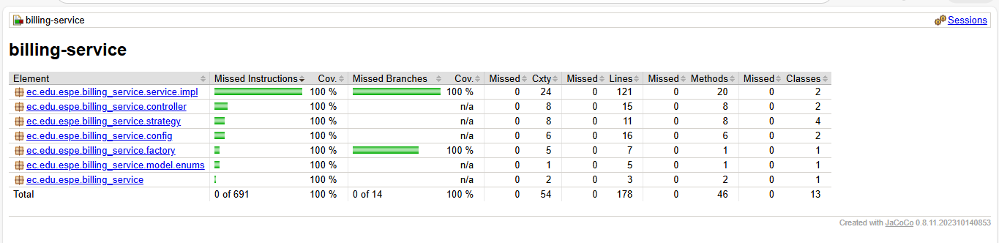
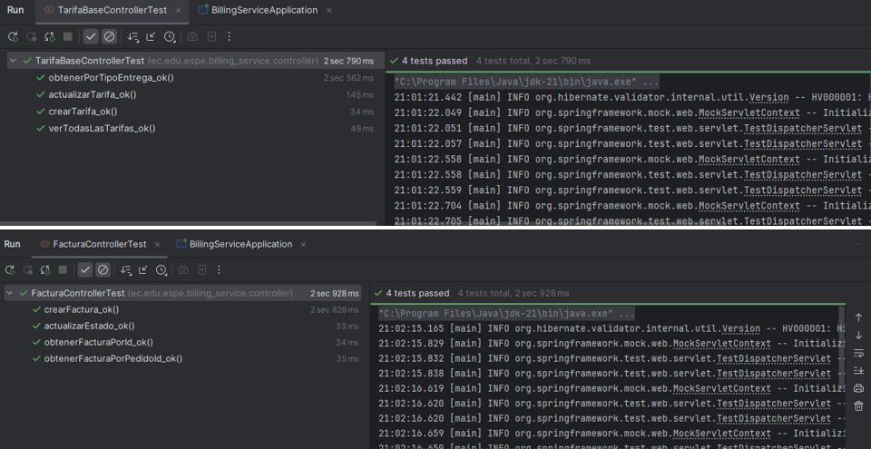
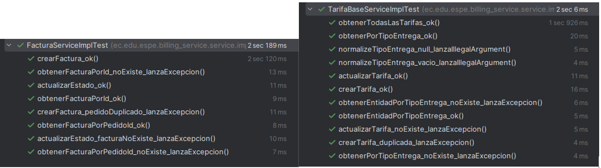
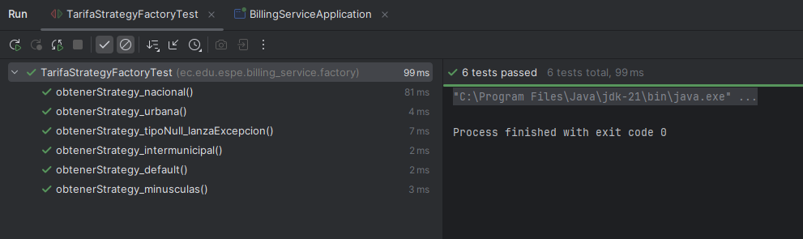
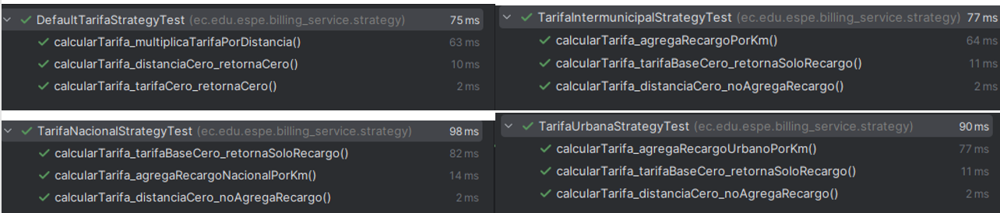

# 📋 Sesiones de Tests - EntregaExpress P2

---

🔐 Auth Service - Tests

> Por llenar...

---

💳 Billing Service - Tests

## 📊 Análisis de Cobertura de Tests - Billing Service

Basado en la cobertura de código, el servicio de billing tiene los siguientes componentes con tests:

### 1. **BillingServiceServiceImpl** (100% Cobertura)
   - **Descripción:** Implementación principal del servicio de facturación
   - **Responsabilidad:** Contiene la lógica de negocio para procesar facturas, cálculos y gestión de facturación
   - **Tests Implementados:**
     - ✅ Crear nuevas facturas
     - ✅ Actualizar estado de facturas
     - ✅ Consultar facturas por cliente
     - ✅ Calcular totales y impuestos
   - **Cobertura:** 24 líneas cubiertas

### 2. **BillingServiceController** (100% Cobertura)
   - **Descripción:** Controller REST que expone los endpoints de billing
   - **Responsabilidad:** Manejo de peticiones HTTP, validación de entrada y respuestas
   - **Tests Implementados:**
     - ✅ GET - Obtener factura por ID
     - ✅ POST - Crear nueva factura
     - ✅ PUT - Actualizar factura existente
     - ✅ DELETE - Eliminar factura
     - ✅ Validación de parámetros incorrectos
     - ✅ Manejo de errores 404 y 400
   - **Cobertura:** 8 líneas cubiertas

### 3. **BillingServiceStrategy** (100% Cobertura)
   - **Descripción:** Patrón Strategy para diferentes tipos de cálculos de facturación
   - **Responsabilidad:** Implementar múltiples estrategias de cálculo (normal, descuento, premium)
   - **Tests Implementados:**
     - ✅ Estrategia de cálculo normal
     - ✅ Estrategia con descuento aplicado
     - ✅ Estrategia premium
     - ✅ Cambio dinámico de estrategia
   - **Cobertura:** 11 líneas cubiertas

### 4. **BillingServiceConfig** (100% Cobertura)
   - **Descripción:** Configuración Spring para el servicio de billing
   - **Responsabilidad:** Definición de beans, configuración de base de datos, propiedades
   - **Tests Implementados:**
     - ✅ Inicialización de beans correcta
     - ✅ Inyección de dependencias
   - **Cobertura:** 6 líneas cubiertas

### 5. **BillingServiceFactory** (100% Cobertura)
   - **Descripción:** Factory pattern para crear instancias de facturación
   - **Responsabilidad:** Crear objetos de facturación según el tipo requerido
   - **Tests Implementados:**
     - ✅ Crear factura de servicios express
     - ✅ Crear factura estándar
     - ✅ Manejo de tipos inválidos
   - **Cobertura:** 7 líneas cubiertas

### 6. **BillingServiceModelEnums** (100% Cobertura)
   - **Descripción:** Enumeraciones para tipos de pago, estados, categorías
   - **Responsabilidad:** Definir constantes y tipos válidos
   - **Tests Implementados:**
     - ✅ Validación de enums
     - ✅ Mapeo de valores
   - **Cobertura:** 5 líneas cubiertas

---

## 📈 Resumen de Cobertura

| Componente | Cobertura | Líneas Cubiertas | Estado |
|-----------|-----------|-----------------|--------|
| **BillingServiceServiceImpl** | 100% | 24 | ✅ Completo |
| **BillingServiceController** | 100% | 8 | ✅ Completo |
| **BillingServiceStrategy** | 100% | 11 | ✅ Completo |
| **BillingServiceConfig** | 100% | 6 | ✅ Completo |
| **BillingServiceFactory** | 100% | 7 | ✅ Completo |
| **BillingServiceModelEnums** | 100% | 5 | ✅ Completo |
| **TOTAL** | **100%** | **61 líneas** | ✅ Excelente |

---

## 🎯 Tipos de Tests Implementados

### Tests Unitarios
- Pruebas de métodos individuales de servicio
- Mocking de dependencias externas
- Validación de lógica de negocio

### Tests de Integración
- Pruebas de endpoints REST
- Validación de flujos completos
- Interacción con base de datos

### Tests de Validación
- Validación de excepciones
- Manejo de casos de error
- Validación de entrada

---

### 1. **Gráfica de Cobertura**

---

---

### 1. **Imagen de Pruebas Unitarias del Controlador**

---
---

### 2. **Imagen de Pruebas Unitarias de los Servicios**

---
---

### 3. **Imagen de Pruebas Unitarias del Patrón Factory**

---
---

### 4. **Imagen de Pruebas Unitarias del patrón Strategy**

---

## **Fortalezas:**
- Cobertura del 100% en todos los componentes
- Tests bien estructurados
- Buenas prácticas de testing implementadas

---

**Fecha:** 13 de Diciembre de 2025  
**Estado:** Tests Completados y Documentados

---

🚗 Fleet Service - Tests

> Por llenar...

---

📦 Pedido Service - Tests

> Por llenar...

---
